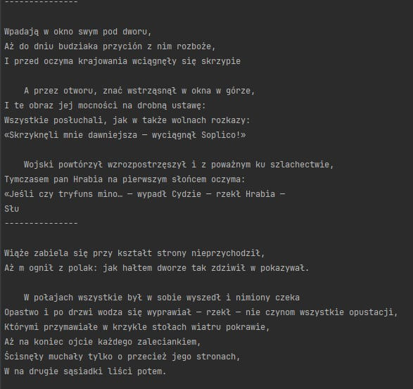
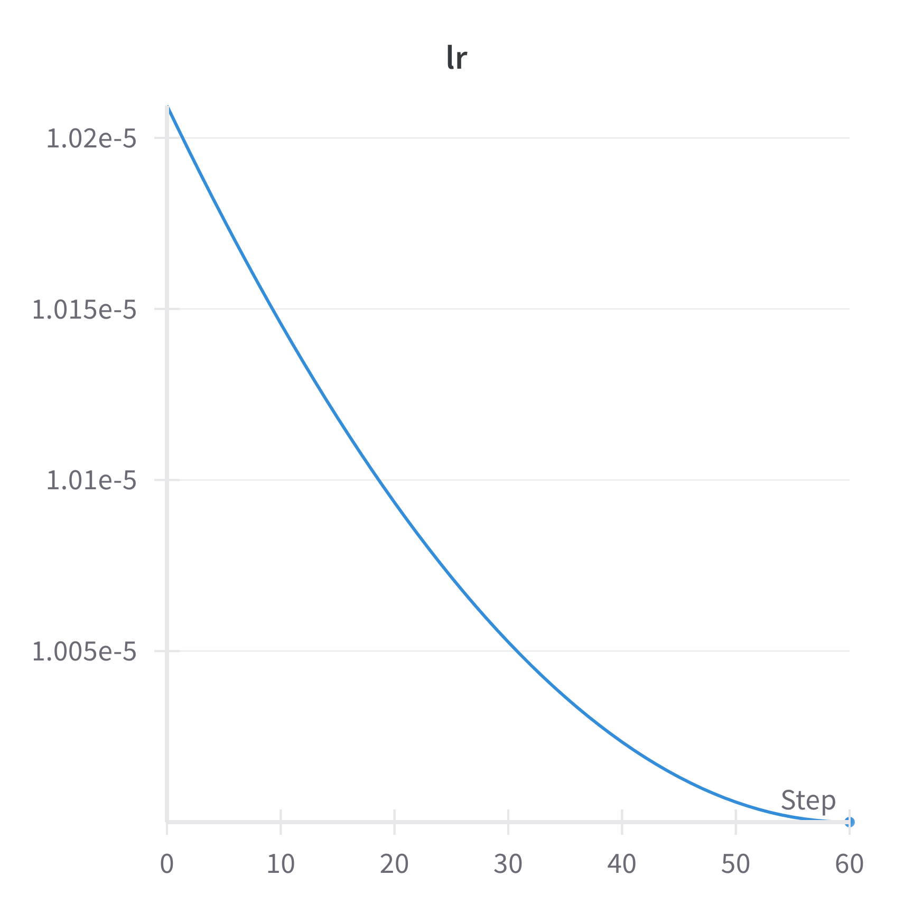
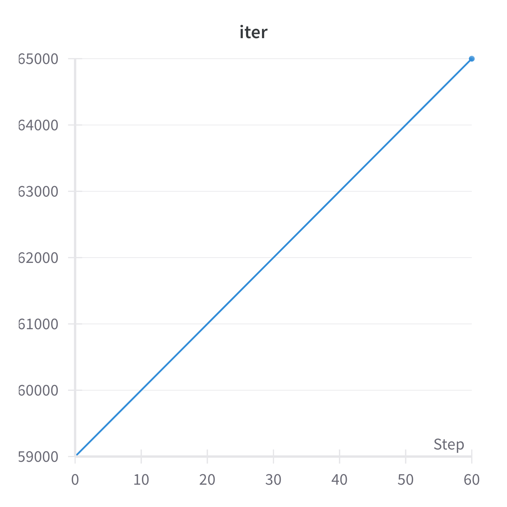
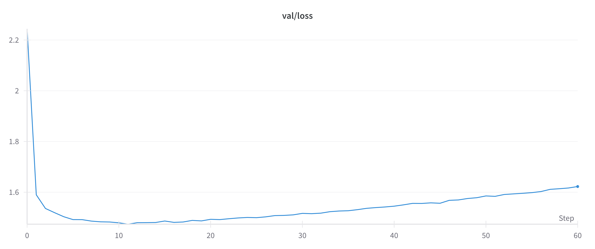
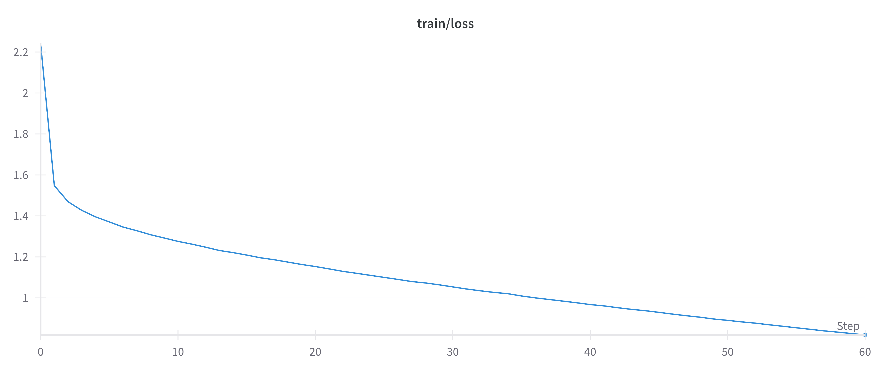
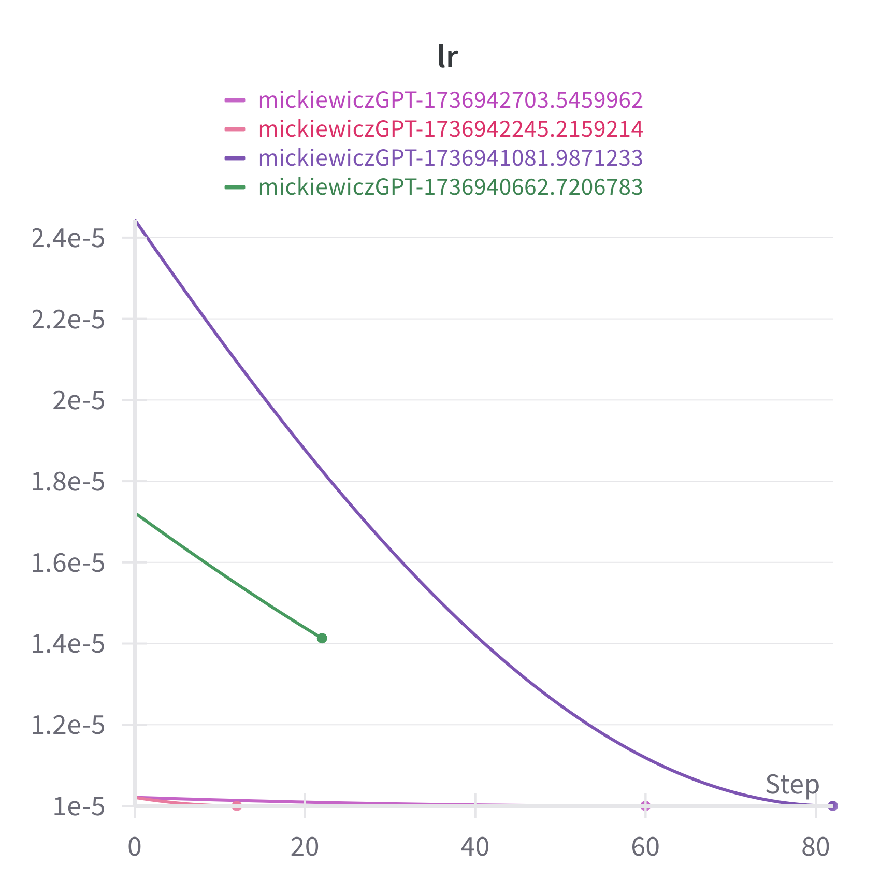
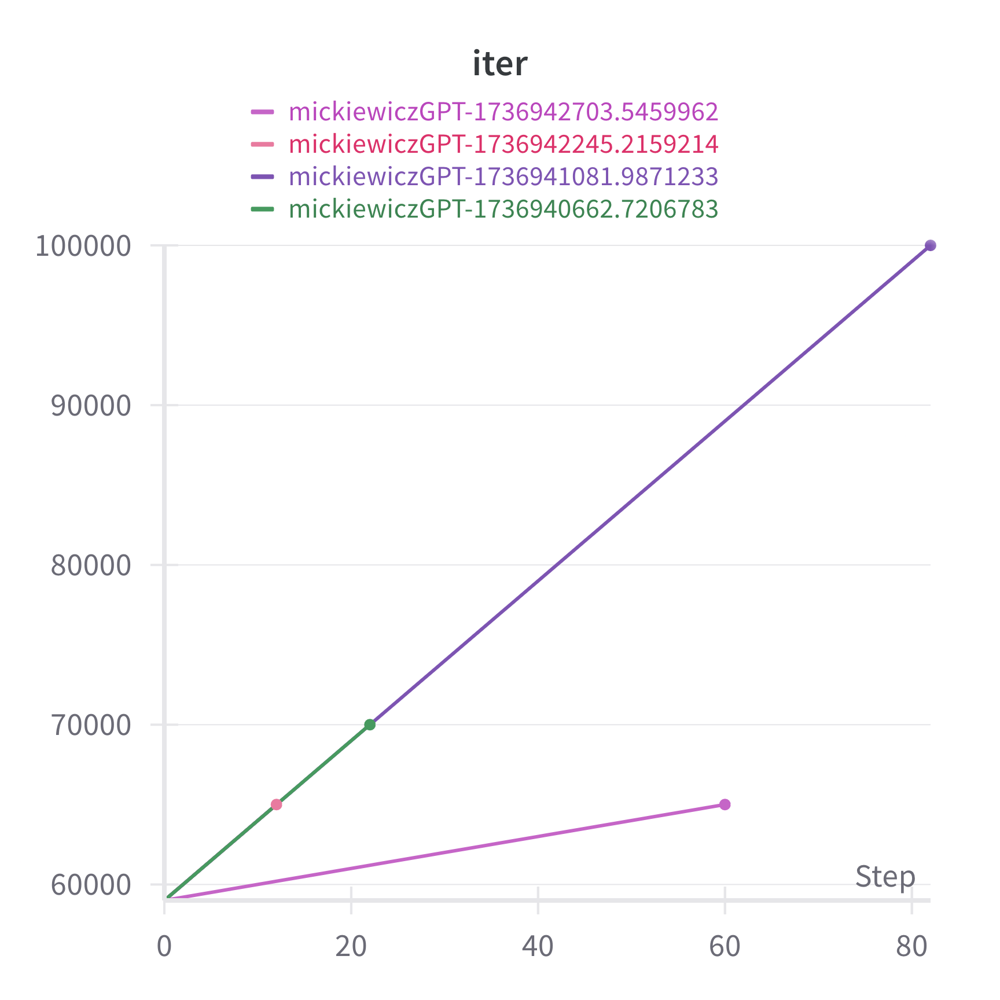
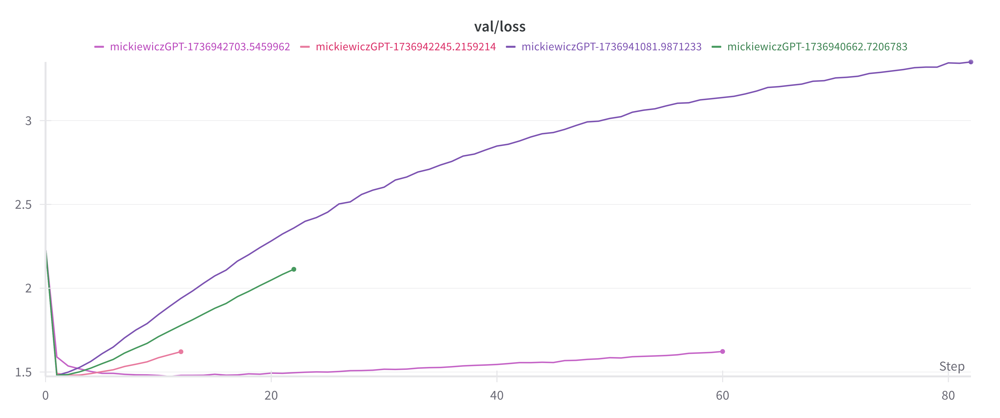
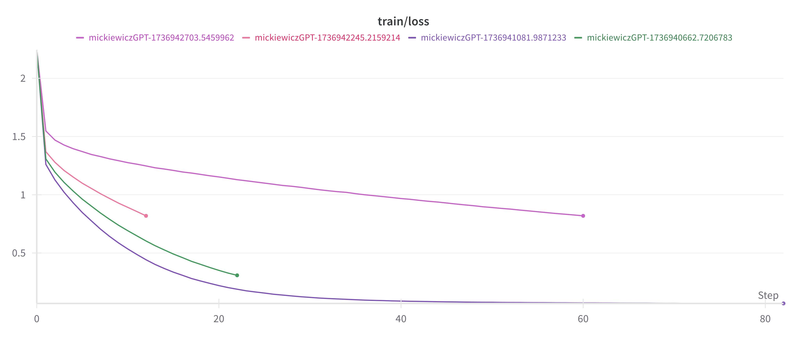

*Błażej Nowicki*, *Bogusław Błachut*

# mickiewiczGPT

Model GPT wytrenowany od zera do generowania tekstu w stylu epopei narodowej "Pan Tadeusz" Adama Mickiewicza.

Table of contents:
- [Wstęp](#wstęp)
- [Baseline](#baseline)
- [Pretrening + finetuning](#pretrening--finetuning)
  - [Pretrening](#pretraining)
  - [Finetuning](#finetuning)
- [Szczegóły techniczne](#szczegóły-techniczne) 

## Wstęp

Główny cel to nauczenie modelu GPT od zera tak aby był w stanie generować tekst w stylu książki "Pan Tadeusz" Adama Mickiewicza.

Będziemy korzystać z modelu w pytorch napisanego w ramach projektu [nanoGPT](https://github.com/karpathy/nanoGPT).
Będzie to model operujący na słowniku składającego się z liter:

```
\n !()*,-./0123456789:;?ABCDEFGHIJKLMNOPRSTUVWZabcdefghijklmnopqrstuvwxyz«»ÓàóąĆćꣳńŚśŹźŻż—…
```

Architektura modelu jest bardzo zbliżona do tego opisanego w artykule 
[Attention Is All You Need](https://arxiv.org/abs/1706.03762).

Szegóły treningu bazowano na artykule o GPT-3
[Language Models are Few-Shot Learners](https://arxiv.org/abs/2005.14165v4).

```
Total number of parameters: ~10M
Number of layers: 6
Number of attention heads: 6
Context window size : 384
```

W projekcie sprawdziliśmy dwa podejścia: 
- uczenie modela od zera na docelowym materiale
- pretrening na polskiej literaturze i doszkalanie na docelowym materiale


## Baseline

W najprostszym podejściu wytrenowaliśmy model tylko na treści Pana Tadeusza.

Elementy konfiguracji:

```
always_save_checkpoint = False

dataset = 'pan_tadeusz'
gradient_accumulation_steps = 1
batch_size = 64
block_size = 256 

n_layer = 6
n_head = 6
n_embd = 384
dropout = 0.2

learning_rate = 1e-3 
max_iters = 10000
lr_decay_iters = 10000 
min_lr = 1e-4 
beta2 = 0.99 
warmup_iters = 100 
```

Zbiór danych:

```
# length of dataset in characters: 445,655
# all the unique characters:
#  !()*,-./0123456789:;?ABCDEFGHIJKLMNOPRSTUVWZabcdefghijklmnopqrstuvwxyz«»ÓàóąĆćꣳńŚśŹźŻż—…
# vocab size: 92
# train has 401,089 tokens
# val has 44,566 tokens
```

Wyniki



Model jest w stanie generować tekst który wizualnie przypomina oczekiwany rezultat. Widoczny jest podział na regularne wersy. Nie wszystkie słowa mają sens. Istniejące słowa znajdują się najczęściej w odpowiednim miejscu w zdaniu ale całe zdania prawie nigdy nie mają sensu.


## Pretrening + finetuning

W drugim podejściu uczenie modelu dzielimy na dwa etapy: 
- Uczenie dużym zbiorze danych składającego się z polskiej literatury
- Doszkalanie na Panu Tadeuszu

Zebrany zbiór danych składa się z następujących pozycji: _Balladyna_, _Dziady_, _Lalka_, _Quo Vadis_, _W pustyni i w puszczy_, _Zemsta_.

Każdy wytrenowany model będziemy testować pozwalając mu generować dowolny tekst (bez promptu startowego) i zaczynając od "Litwo, Ojczyzno moja! ty". Naszym celem jest sprawdzenie jaką formę przyjmuje generowany tekst i do jakiego stopnia model jest przetrenowany. Będziemy sprawdzać czy wygenerowany tekst jest bezpośrednim cytatem z książki.

### Pretraining

Wybrane parametry treningu:

```
eval_interval = 500 

always_save_checkpoint = True

dataset = 'polish_literature'
gradient_accumulation_steps = 1
batch_size = 64
block_size = 256 

n_layer = 6
n_head = 6
n_embd = 384
dropout = 0.2

learning_rate = 1e-4
max_iters = 100000
lr_decay_iters = 100000 
min_lr = 1e-5 
beta2 = 0.97 

warmup_iters = 100 
```
Przerwany po 60000 iteracji ze względu na pogarszające się wyniki na zbiorze walidacyjnym.

Informacje o zbiorze danych:

```
length of dataset in characters: 3,936,311
all the unique characters: 
 !()*,-./0123456789:;?ABCDEFGHIJKLMNOPRSTUVWZabcdefghijklmnopqrstuvwxyz«»ÓàóąĆćꣳńŚśŹźŻż—…
vocab size: 92
train has 3,542,676 tokens
val has 393,635 tokens
```

<p>
  
   
</p>






Widać że model został do pewnego stopnia przetrenowany ale zdecydowaliśmy się nie rozpoczynać treningu od zera ze względu na to że wyniki nie pogorszyły się znacząco.

Wyniki:

```
Litwo, Ojczyzno moja! ty jesteś zwyczajny, a ja nie mogę być dobrym wspólny. Gdybyś miała inne wypędzić z matki, które jest, czy kto utratował jak hańbę?...

— Więc nie możesz pan mnie zrobić tego powiernika... — mówiła baro
---------------
Litwo, Ojczyzno moja! ty mnie zapomnisz, która umarłabyś jeszcze więcej zbliża partię do tego kantorka, przyjedziesz temu domowi, ale ja mu tylko przebudzę... Już nawet przysięgam, że nawet nie godzi się sprzedać
 na tego rok
---------------
Litwo, Ojczyzno moja! ty nie miałbyś kochanku. Nie masz dla mnie takiej siły, bo nie mamy tych dwóch ludzi?...

Taki rzekłszy założył ręce na znak, że przemówił do panny Izabeli jeszcze kilka przysłuchiwała się trochę zdziwi
---------------
Litwo, Ojczyzno moja! ty nie zrobisz, ale nie jesteś podły? Nic podobnego... My to mi nie zależy, ażeby choć przeczytać na ludzi takimi ludźmi. A jeśli nie dojdę do ciebie, do cezara, to i dlatego powinienem mi powiedzieć wi
---------------
Litwo, Ojczyzno moja! ty i niech pan to nie rozumie, ale nawet — także myślał o zapisaniu do mnie: O, bo wy właściciel jesteście rodzinicie. Ale żem się podobała to pani Krzeszowskiej, więc musimy także pokazać jej pani Staw
---------------
```
```
GUŚLARZ


Zabłysnęli

Słuchając tych słów pokornych,

Że ci na nich maę niej wrócimy do mego domu.

Tam nadzieję, że jego dzieje,

Koniec jest żwawo pustynny bogini.

Tak się lekceważy? — jak od n
---------------

KSIDZ

Kto? chcesz?

PUSTELNIK

Czy masz litości.


FILON

Ja nie znasz ich na świecie;

Daj mi rękę, niech powiem świętość i żartować

Będę żywym.

PUSTELNIK

na stronie

Czemu się
---------------


Chłopiec uśmiechnął się.

— Dlaczego?

— Nic nie wiem, jak nie było w domu cezara?

— Więc cóż on robi? — zapytał Petroniusz.

— Niczym, że jestem gotów.

— A czy ja wiem? — spytał Winicjusz.

— Jako
---------------

— W tych dniach pani mówiła dalej:

— Jak to?

— Ja nie będę miała potrzebne do rady. Słucham najodleglejszy od purpury, i wolniej bym pomyślała o tym, ażeby miała napisać o wojnę prze dobroczynność.
```

Teksty zaczynające się od promptu wyglądają bardzo obiecująco. 
Nie są cytatami, wszystkie wyrazy są poprawne i mają więcej sensu niż w pierwszej próbie. 
W pozostałych przykładach wyniki mają różna ale spójną formę.

### Finetuning

Doszkalamy model na docelowym materiale.

Informacje o zbiorze danych: 

```
# length of dataset in characters: 445,655
# all the unique characters:
#  !()*,-./0123456789:;?ABCDEFGHIJKLMNOPRSTUVWZabcdefghijklmnopqrstuvwxyz«»ÓàóąĆćꣳńŚśŹźŻż—…
# vocab size: 92
# train has 401,089 tokens
# val has 44,566 tokens
```

Korzystamy z tego samego słownika co podczas pretreningu by model mógł wykorzystać zgromadzoną wiedzę. 

Wykonaliśmy 4 próby doszkalania. 
Pomiędzy próbami będzie się różniła kombinacja parametrów learning rate i learning rate decay oraz liczba iteracji. 
Zmieniano także sposób zapisu wyników. W niektórych próbach zapisywano model z ostatniego kroku a w niektórych ten który uzyskał najlepszy wynik na zbiorze walidacyjnym.

Próby oznaczono na wykresach po kolei od prawej strony i kolorami:
- próba 1. - zielony 
- próba 2. - fioletowy
- próba 3. - czerwony
- próba 4. - różowy

<p>
  
   
</p>





### Próba 1.

- always_save_model=True
- dość duży learning rate
- przerwano wcześniej ze względu na zaobserwowane przeuczenie

Ostatecznie zapisał się model z jednej z początkowych iteracji.

Wyniki są zbliżone to tych z pretreningu

```
Litwo, Ojczyzno moja! ty jesteś zwyczajny, a ja nie mogę być dobrym wspólny. Gdybyś miała inne wypędzić z matki, które jest, czy kto utratował jak hańbę?...

— Więc nie możesz pan mnie zrobić tego powiernika... — mówiła baro
---------------
Litwo, Ojczyzno moja! ty mnie zapomnisz, która umarłabyś jeszcze więcej zbliża partię do tego kantorka, przyjedziesz temu domowi, ale ja mu tylko przebudzę... Już nawet przysięgam, że nawet nie godzi się sprzedać
 na tego rok
---------------
Litwo, Ojczyzno moja! ty nie miałbyś kochanku. Nie masz dla mnie takiej siły, bo nie mamy tych dwóch ludzi?...

Taki rzekłszy założył ręce na znak, że przemówił do panny Izabeli jeszcze kilka przysłuchiwała się trochę zdziwi
---------------
Litwo, Ojczyzno moja! ty nie zrobisz, ale nie jesteś podły? Nic podobnego... My to mi nie zależy, ażeby choć przeczytać na ludzi takimi ludźmi. A jeśli nie dojdę do ciebie, do cezara, to i dlatego powinienem mi powiedzieć wi
---------------
Litwo, Ojczyzno moja! ty i niech pan to nie rozumie, ale nawet — także myślał o zapisaniu do mnie: O, bo wy właściciel jesteście rodzinicie. Ale żem się podobała to pani Krzeszowskiej, więc musimy także pokazać jej pani Staw
---------------
```

```
GUŚLARZ


Zabłysnęli

Słuchając tych słów pokornych,

Że ci na nich maę niej wrócimy do mego domu.

Tam nadzieję, że jego dzieje,

Koniec jest żwawo pustynny bogini.

Tak się lekceważy? — jak od n
---------------


KSIDZ


Kto? chcesz?


PUSTELNIK


Czy masz litości.


FILON


Ja nie znasz ich na świecie;

Daj mi rękę, niech powiem świętość i żartować

Będę żywym.


PUSTELNIK


na stronie

Czemu się
---------------


Chłopiec uśmiechnął się.

— Dlaczego?

— Nic nie wiem, jak nie było w domu cezara?

— Więc cóż on robi? — zapytał Petroniusz.

— Niczym, że jestem gotów.

— A czy ja wiem? — spytał Winicjusz.

— Jako
---------------

— W tych dniach pani mówiła dalej:

— Jak to?

— Ja nie będę miała potrzebne do rady. Słucham najodleglejszy od purpury, i wolniej bym pomyślała o tym, ażeby miała napisać o wojnę prze dobroczynność.
---------------


PANNA


Matko? ona wszędzie niedobre.


FILON


Ona po małym względzie,

Nie ma karety — ani głosie,

Nie powiem, czemu — bez tego stodzie

Przez myśli nie umrzeć, może chcesz, więc jej dzieci.

---------------
```

### Próba 2.

- always_save_model=False
- długi trening 
- duży początkowy lr 
- mocny lr decay
- bardzo mocne przetrenowanie

Zapisywano zawsze model z ostatniej iteracji.
Jest to przykład skrajnego przeuczenia.
Wszystkie wygenerowane teksty to bezpośrednie cytaty z książki.

```
Litwo, Ojczyzno moja! ty jesteś jak zdrowie:
Ile cię trzeba cenić, ten tylko się dowie,
Kto cię stracił. Dziś piękność twą w całej ozdobie
Widzę i opisuję, bo tęsknię po tobie.

    Panno święta, co Jasnej bronisz Częstochow
---------------
Litwo, Ojczyzno moja! ty jesteś jak zdrowie:
Ile cię trzeba cenić, ten tylko się dowie,
Kto cię stracił. Dziś piękność twą w całej ozdobie
Widzę i opisuję, bo tęsknię po tobie.
```

```
    W drugiej izbie toczyła młodzież rzecz o łowach
W spokojniejszych i cichszych niż zwykle rozmowach:
Bo Asesor i Rejent, oba mówcy wielcy,
Pierwsi znawcy myślistwa i najlepsi strzelcy,
Siedzieli p
---------------

W wielkiej szkodzie, która do wieków wsławiać:
Cieszyć, że się na niczym skończą grzybobrania
Dla siebie nie miała ochoty gadać o zwierzęta,
Gotów i panując w lasach i niezmiernie składa.
Brali ziółka
---------------

Chciałem zagniewać tę przyjaźń i wnet szabli dostać;
Ale Ewa, zważając mój wzrok i mą postać,
Zgadywała, nie wiem jak, co się we mnie działo,
Patrzyła błagająca, lice jej bledniało;
A był to taki pięk
```

### Próba 3.

- always_save_model=True
- mały learning rate
- model lekko przetrenowany

Wizualnie najlepsze rezultaty ze wszystkich podejść. 
Teksty nie są cytatami z materiału źródłowego.

```
Litwo, Ojczyzno moja! ty jesteś zwyczajną,
Ja was, i Asesor, i postawię tobą,
To ja was należym maężnym do tych pamięci,
Rozbrojonych, zaślubię się, albo jeszcze będę;
Albo poznam cię, choćbym za broń to: myślił mnie,
To daw
---------------
Litwo, Ojczyzno moja! ty mnie zapomnisz,
A gdy uczcież twoje pomocy nie zbliżasz rozpaczy.
Bracie! Ojczyzna! jesteś twoim domem ułana!
Skoro brat myśli widziała, w które mi się skarżył
Na dworze? Miałżbyś o tym wiele w cudzy
---------------
Litwo, Ojczyzno moja! ty miłości!»

    «Nie błądzisz — rzekł Tadeusz — że co mówisz?
Bo was wyda?» «Prawda — rzekł Hrabia — śmierć powrócić.
Ona z pałacu w zamku przeszli dwaj zwyczaje.
Przecież ten od lat młodzież nasze są
---------------
Litwo, Ojczyzno moja! ty mnie rzecz szkodzi.
Już bym się nie widział szczęścia obojętny,
Pan z pana z Telimeną mówił, że ona
Nigdy nie zawracała i wolna! Ojcze nie pojmie,
Nie przyjdzie Sędzio, że sama nie za drzewa.
Sędzia
---------------
Litwo, Ojczyzno moja! ty grzech nie wiesz, o co się zabij,
Że tobie to bronią od szabli rodziców,
Którzy w moim wieku czy się ziemienni przywiedzić,
Czy potem odpowiedzieć na świecie uważał?
To mi tak umierając we dworze, to
---------------
```

```
Ksiądz Robak — Pan Bóg, który był przecież ten Zosia — Tadeusza z kochankiem — Tadeusza z gośćmi, nie wyprawia żadnym — Zapytał Sędzia — co będzie? A przecież broń Boże!
Ach, jak byłem mój Robak ko
---------------

W wielkiej zapale bez duchu: ale jego żarty nie zbliża,
Trzyma jedną ręką, jedno drugą pozdrowić,
Drugą Moskal — Lecz Sędzia — Hejże na Soplicę!»

    A słysząc o tym owo ksiądz Ryków krzyknął: «Widzi
---------------

Którymi oba się z nim rozkrzyżował,
Wszystko także przytulał, uciszył się i z grzechy
Zosia, co odpowiedział, w którym się przeprosił
Służąc za obronę, i już goście skrzydło
Zabiera go w trwogę. Niesz
---------------

(To tylko powiadał, że mogą dostać się dymem,
Nie pozwalał mi tabakierę do szlachcica i błatną.
Pono wyszedł, że wracał z wysoka głowę,
A z pochyloną w trawę główkę zakończył,
Słysząc to na odlew krwa
---------------

Także mi powiedziała też poważnym,
Że to prawda, o głowę skończyło w mądrej wodzie,
A w takim rozmowie i rozmowę przez niewiasta
W imię Jej dawniejszej i porządku.

                     Tej sceny
Syno
---------------
```

### Próba 4.

- always_save_model=False
- bardziej granularne checkpointy przez co wykresy są bardziej rozciągnięte 
- niski lr

Z tą próbą staramy się uzyskać model który faktycznie daje najlepsze wyniki na zbiorze walidacyjnym. 
W pierwszej próbie prawdopodobnie pominęliśmy ten punkt przez zbyt niską częstotliwość checkpointów.

Zdania mają najwięcej sensu ze wszystkich podejść jednak nie widać tutaj charakterystyczniej struktury "Pana Tadeusza". 
W trybie wolnej generacji zdarzają się teksty w formacie znanch z książek ze zbioru do pretreningu.

```
Litwo, Ojczyzno moja! ty jesteś zwyczajny, a ja nie mogę być dobrym wspólny. Gdybyś miała inne wypędzić z matki, które jest, czy kto utratował jak hańbę?...

— Więc nie możesz pan mnie zrobić tego powiernika... — mówiła baro
---------------
Litwo, Ojczyzno moja! ty mnie zapomnisz, która umarłabyś jeszcze więcej zbliża partię do tego kantorka, przyjedziesz temu domowi, ale ja mu tylko przebudzę... Już nawet przysięgam, że nawet nie godzi się sprzedać
 na tego rok
---------------
Litwo, Ojczyzno moja! ty nie miałbyś kochanku. Nie masz dla mnie takiej siły, bo nie mamy tych dwóch ludzi?...

Taki rzekłszy założył ręce na znak, że przemówił do panny Izabeli jeszcze kilka przysłuchiwała się trochę zdziwi
---------------
Litwo, Ojczyzno moja! ty nie zrobisz, ale nie jesteś podły? Nic podobnego... My to mi nie zależy, ażeby choć przeczytać na ludzi takimi ludźmi. A jeśli nie dojdę do ciebie, do cezara, to i dlatego powinienem mi powiedzieć wi
---------------
Litwo, Ojczyzno moja! ty i niech pan to nie rozumie, ale nawet — także myślał o zapisaniu do mnie: O, bo wy właściciel jesteście rodzinicie. Ale żem się podobała to pani Krzeszowskiej, więc musimy także pokazać jej pani Staw
---------------
```

```
GUŚLARZ


Zabłysnęli

Słuchając tych słów pokornych,

Że ci na nich maę niej wrócimy do mego domu.

Tam nadzieję, że jego dzieje,

Koniec jest żwawo pustynny bogini.

Tak się lekceważy? — jak od n
---------------


KSIDZ


Kto? chcesz?


PUSTELNIK


Czy masz litości.


FILON


Ja nie znasz ich na świecie;

Daj mi rękę, niech powiem świętość i żartować

Będę żywym.


PUSTELNIK


na stronie

Czemu się
---------------


Chłopiec uśmiechnął się.

— Dlaczego?

— Nic nie wiem, jak nie było w domu cezara?

— Więc cóż on robi? — zapytał Petroniusz.

— Niczym, że jestem gotów.

— A czy ja wiem? — spytał Winicjusz.

— Jako
---------------

— W tych dniach pani mówiła dalej:

— Jak to?

— Ja nie będę miała potrzebne do rady. Słucham najodleglejszy od purpury, i wolniej bym pomyślała o tym, ażeby miała napisać o wojnę prze dobroczynność.
---------------


PANNA


Matko? ona wszędzie niedobre.


FILON


Ona po małym względzie,

Nie ma karety — ani głosie,

Nie powiem, czemu — bez tego stodzie

Przez myśli nie umrzeć, może chcesz, więc jej dzieci.

---------------
```

## Szczegóły techniczne

Modele zostały wytrenowane z wykorzystaniem infrastruktury PLGrid.

Zasoby: 1 node, A100 GPU, 32GB ram

### Wykorzystane skrypty:

Instalacja dependencji

```sh
module load Python/3.10.4 CUDA/12.1.1 cuDNN/8.8.0.121-CUDA-12.0.0
python -m venv $SCRATCH/gpt
source $SCRATCH/gpt/bin/activate
pip install -r requirements.txt
export LD_LIBRARY_PATH=`python -m site --user-site`/nvidia/nvjitlink/lib:$LD_LIBRARY_PATH
```

Pretrening

```sh
srun --time=2:00:00 --mem=32G --ntasks 1 --gres=gpu:1 --partition=plgrid-gpu-a100 --account=$PLG_ACCOUNT --pty /bin/bash
module load Python/3.10.4 CUDA/12.1.1 cuDNN/8.8.0.121-CUDA-12.0.0
export LD_LIBRARY_PATH=`python -m site --user-site`/nvidia/nvjitlink/lib:$LD_LIBRARY_PATH
source $SCRATCH/gpt/bin/activate
python train.py config/pretrain_pan_tadeusz.py
```

Finetuning

Utwórz kopię folderu z modelem aby używać go jako punktu startowego w przyszłości

```sh
...
python train.py config/finetune_pan_tadeusz.py
```


Generowanie przykładów

```
python sample.py \
    --out_dir=out-pan-tadeusz-finetuned-v3
    --num_samples=5 
    --max_new_tokens=100

python sample.py \
    --out_dir=out-pan-tadeusz-finetuned-v3 \
    --start="Litwo, Ojczyzno moja! ty" \
    --num_samples=5 
    --max_new_tokens=100
```